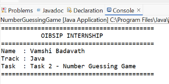
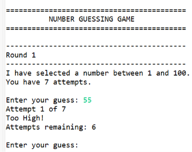
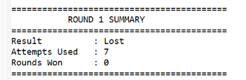

# Number Guessing Game

## Project Description

The Number Guessing Game is a Java console-based application developed as part of the OIBSIP Java Programming Internship – Task 2.

The program generates a random number, and the player tries to guess it. After each incorrect guess, the game provides a hint indicating whether the guess is too high or too low. The game also keeps track of the number of attempts and displays the result after the correct guess.

## Features

- Random number generation
- User input for guesses
- High/low hints
- Attempt counter
- Multiple rounds
- Round summary

## Technologies Used

- Java
- Eclipse IDE

## How to Run

1. Open the project in Eclipse.
2. Open `NumberGuessingGame.java`.
3. Run the program as a Java Application.
4. Enter your guesses in the console.

## Author

**Vamshi B**

**OIBSIP – Java Programming Internship**

## Screenshots

### Title Screen

### Game Play

### Round Summary

