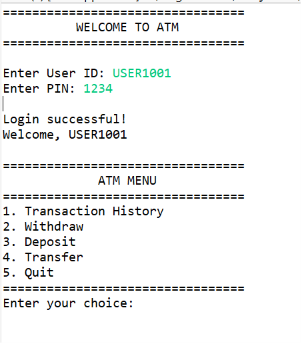
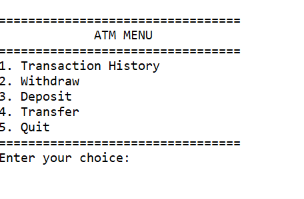
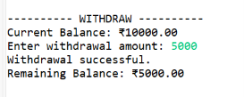
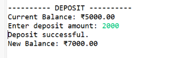
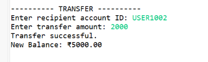
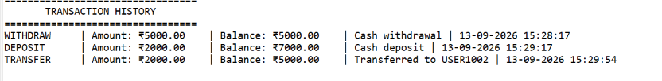
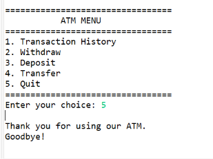

# ATM Interface

## Project Description

The ATM Interface is a Java console-based application developed as part of the OIBSIP Java Programming Internship – Task 3.

The program simulates a basic ATM machine where users can authenticate using a User ID and PIN and perform common banking transactions. Users can check their transaction history, withdraw money, deposit money, and transfer money to another account.

## Features

- User ID and PIN authentication
- Maximum 3 incorrect login attempts
- Transaction history
- Withdraw money
- Deposit money
- Transfer money
- Balance validation
- Insufficient funds validation
- Transaction logging using ArrayList
- Multiple bank accounts
- Console-based menu
- Object-Oriented Programming design

## Technologies Used

- Java
- Eclipse IDE
- Object-Oriented Programming
- ArrayList
- HashMap

## How to Run

1. Open the project in Eclipse.
2. Open `Main.java`.
3. Run the program as a Java Application.
4. Enter a valid User ID and PIN.
5. Select an option from the ATM menu.
6. Perform the required banking transaction.

## Sample Login

**User ID:** `USER1001`  
**PIN:** `1234`

## Author

**Vamshi B**

**OIBSIP – Java Programming Internship**

## Screenshots

### Login

### ATM Menu

### Withdrawal

### Deposit

### Transfer

### Transaction History

### Final Output

### Demo Video
[Watch the ATM Interface Demo]( https://drive.google.com/file/d/1R0b6H7IQXN4luIFn2BkURTIwl1GuPoGe/view?usp=drive_link)
